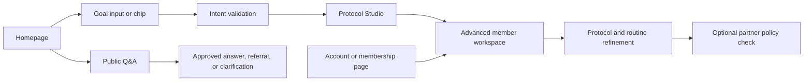
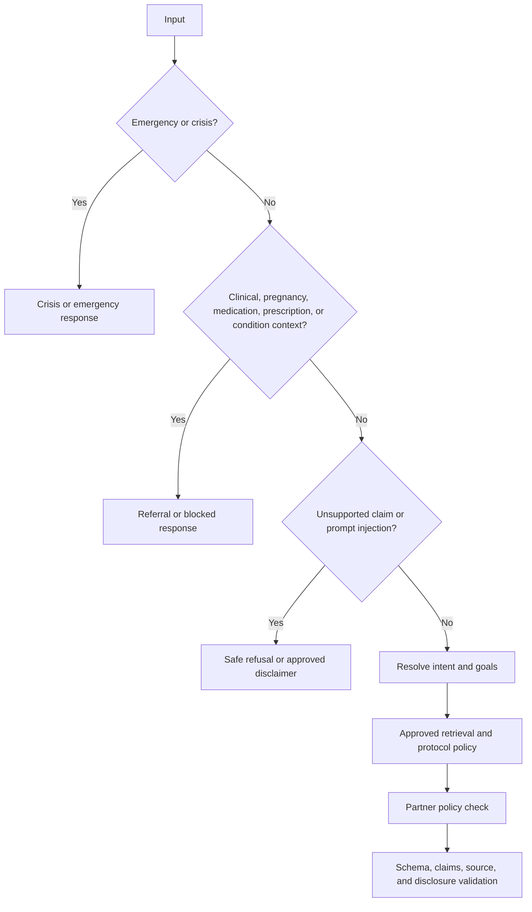
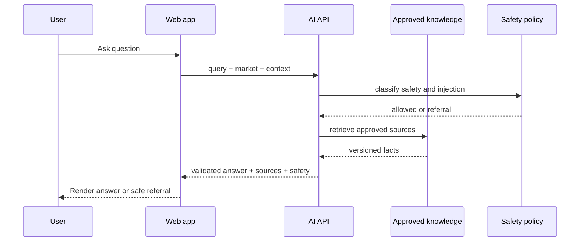
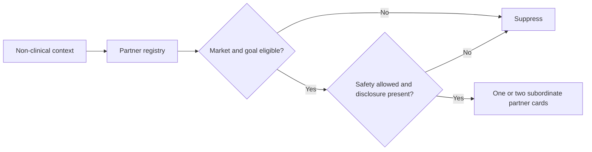
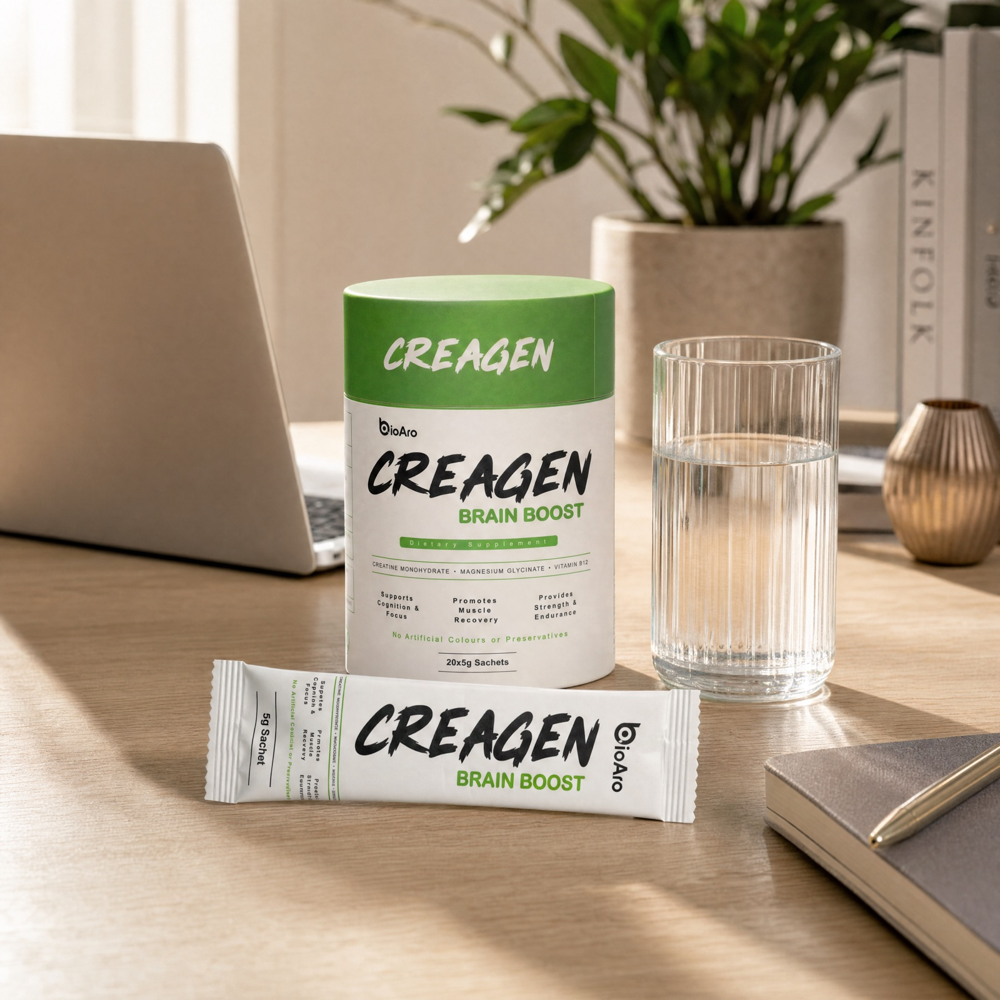
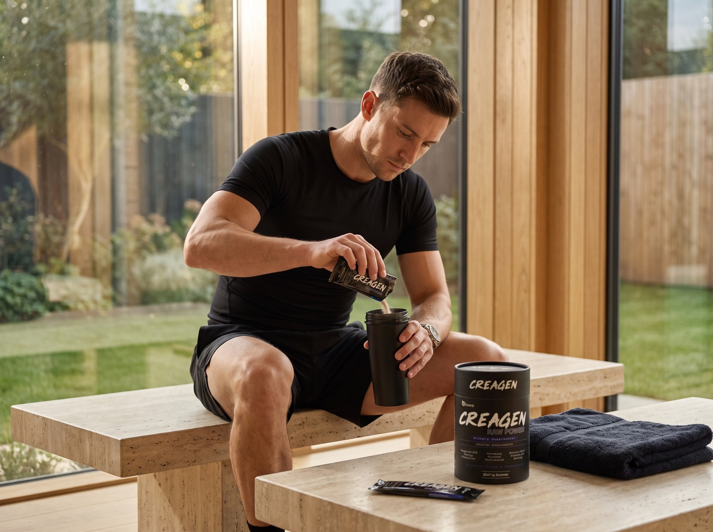

# BioAro Drugs AI Model Handoff v2

**Audience:** AI, backend, product, frontend, data, safety, regulatory, and DevOps teams  
**Status:** Production planning and implementation handoff  
**Canonical source:** This Markdown file  
**Last reviewed:** 2026-08-18  
**Supersedes for implementation planning:** `bioaro-ai-model-handoff.md`  

## 1. Executive Summary

BioAro Drugs AI is a 360-degree everyday-health assistant combining advanced BioAro knowledge with guidance shaped by clinical experience. It helps users understand approved product information, interpret non-clinical goals, build a structured routine, and return to refine it over time.

The product model is **Ask -> Build -> Evolve**:

- **Ask:** approved product, ingredient, usage, availability, and educational information.
- **Build:** a starting protocol assembled from stated goals and structured answers.
- **Evolve:** a persistent member workspace where goals, conversations, and routines can be revisited.

The model may interpret language and produce structured candidates. It must never own product facts, prices, inventory, medical decisions, partner eligibility, or membership entitlement. Backend policy and approved data remain authoritative.

### Release boundary

The current frontend has deterministic keyword matching, approved local retrieval, deterministic protocol rules, browser-only conversation history, browser-only attachment previews, and local demo membership. Production launch requires server-side retrieval, safety policy, structured-output validation, authenticated persistence, verified entitlement, and approved regulatory content.

## 2. Product Positioning And Boundaries

### Public AI

Public AI is for exploration: product questions, ingredient information, usage, regional availability, basic educational answers, and starting a goal conversation.

### Membership

Membership provides continuity: the advanced workspace, guided protocol building, saved conversations, a daily routine view, and ongoing refinement. It is not medical advice and must not be framed as clinically superior intelligence.

### Explicit exclusions

The system must not diagnose, prescribe, interpret prescriptions, recommend drug interactions, interpret biomarkers or genetics, make clinical decisions, guarantee outcomes, or replace a doctor, pharmacist, or qualified healthcare professional.

## 3. Current Implementation Versus Production Target

| Area | Implemented in the current app | Production requirement |
| --- | --- | --- |
| Q&A | Approved local retrieval and deterministic fallback | Server retrieval with citations and policy validation |
| Intent | Keyword goal matching and frontend result contracts | Validated classifier/model over the complete intent catalogue |
| Protocol | Deterministic `buildProtocol` rules | Model-assisted clarification, deterministic product validation |
| Safety | Client classifier for approved copy | Server-first safety precedence and refusal pipeline |
| Catalogue | Local editorial fallback plus Shopify mapping | Versioned live catalogue with price, stock, market, and claim controls |
| Membership | Demo snapshot or unavailable backend | Authenticated backend entitlement snapshot |
| History | Browser `localStorage`; resumable local records | Account-bound encrypted persistence and deletion controls |
| Attachments | Browser object URLs; no upload, OCR, or interpretation | Explicit storage boundary; no prescription interpretation in V1 |
| Partners | Registry contract; BioSports, Biogevity, and BioAro Labs draft | Approved registry plus backend eligibility policy |

## 4. User Journeys And Entry Points



Supported entry points are the homepage AI field, homepage goal chips, floating AI control, header AI navigation, account dashboard, membership page, previous-chat resume, and direct `/:market/ai` visits. A public question does not automatically force a membership purchase. A protocol-building handoff may open the advanced route, where non-members see the membership gate.

## 5. Complete Intent Catalogue

The classifier must use the following controlled IDs. This is the complete **50-intent vocabulary** from the AI team's routing contract. Product, route, goal, and safety are policy families, not extra IDs; an ID may belong to more than one family and is listed once in the classifier registry. Every intent has an action, response mode, safety check, and fallback. Unknown or low-confidence input must not be forced into a known class.

### Product and formula intents

`product_information`, `ingredient_information`, `supplement_facts`, `dosage_directions`, `timing_usage`, `product_compatibility`, `dietary_allergen`, `warnings_precautions`, `expected_results_timeline`, `compare_products`, `product_format_convenience`, `pricing_availability`, `stock_availability`, `product_reviews_intent`, `subscription_reorder_intent`, `certificate_batch_intent`, `testing_quality_intent`, `unsupported_product_claim_intent`.

### Goal and outcome intents

`energy_vitality`, `longevity_healthy_aging`, `focus_cognitive_performance`, `strength_muscle_performance`, `recovery_endurance`, `sleep_relaxation`, `heart_brain_cellular_wellness`, `womens_energy_vitality`, `antioxidant_skin_cellular_support`.

### Product-specific intents

The seven canonical product handles currently covered by the intent contract are:

| Product intent family | Canonical handle |
| --- | --- |
| LONgevity+ | `longevity-plus` |
| Glutara | `glutara` |
| Creagen Raw Power | `creagen-raw-power` |
| Creagen Pro Power | `creagen-pro-power` |
| Creagen Femme Energy | `creagen-femme-energy` |
| Creagen Brain Boost | `creagen-brain-boost` |
| CellOmega+ | `cellomega-plus` |

Product-specific intent IDs must resolve by handle, never by generated product name.

### Route, membership, and safety intents

Route-linked intents include the 12 existing market-aware navigation destinations: shop/catalogue, quiz/protocol builder, science, journal, about, support, FAQ, disclaimer, account, membership, AI workspace, and partner/service navigation. Safety-linked intents include pregnancy/breastfeeding, medication interaction, diagnosed condition, urgent safety, unsupported claim, and professional-guidance requests. `unsupported_product_claim_intent` is intentionally shared by the product and safety families, not counted twice. Exact route names remain market-aware and must use the existing route helper.

## 6. Intent-To-Action Matrix

| Intent family | Backend action | Response mode | Maximum UI output | Fallback |
| --- | --- | --- | --- | --- |
| Product information | Retrieve approved product fields | `answer` | One answer plus source | `no-match` |
| Ingredient/supplement facts | Retrieve exact approved field and dose | `answer` | One answer plus source | Never guess; `no-match` |
| Usage/timing | Retrieve label directions and approved usage copy | `answer` | One answer plus disclaimer | Professional guidance if sensitive |
| Compatibility/allergen/warnings | Policy check, then retrieve warnings | `answer` or `sensitive` | No product recommendation on blocked state | Referral |
| Price/stock/availability | Read live Shopify/market catalogue | `answer` | One product or max two comparisons | `unavailable` |
| Compare products | Retrieve two approved handles | `answer` | Maximum two products | Clarification |
| Goal/outcome | Map goal to ranked approved products | `needs-quiz`, `protocol`, or `answer` | Maximum two product cards | Clarification/no-match |
| Product-specific goal | Product intent wins after safety check | `answer` or `protocol` | Requested product plus one alternative at most | Product clarification |
| Route/navigation | Return market-aware route | `route` | One destination CTA | `fallback_unknown_intent` |
| Membership/commerce | Read membership/offer state | `route` or `answer` | One primary CTA | Support |
| Safety/clinical | Stop product and partner pipeline | `sensitive` or `referral` | Safety copy and handoff only | Emergency-specific copy |
| Partner service | Run registry policy endpoint | `answer` with partner field | One or two subordinate cards | Suppress |

`routeSummary` alone is not an answer. Informational intents must use the additive `answer` mode and include grounded sources.

## 7. Goal-To-Product Recommendation Matrix

This table is the initial deterministic fallback and must be reviewed by Product and Regulatory before production. The model cannot invent a mapping.

| Goal | Primary approved starting handle | Secondary candidate | Rule |
| --- | --- | --- | --- |
| `energy_vitality` | `cellomega-plus` | `creagen-femme-energy` only when explicitly relevant | Prefer foundational support; no medical claim |
| `longevity_healthy_aging` | `longevity-plus` | `cellomega-plus` | Healthy-ageing language only |
| `focus_cognitive_performance` | `creagen-brain-boost` | `cellomega-plus` | Use focus/product facts, not cognitive diagnosis |
| `strength_muscle_performance` | `creagen-pro-power` | `creagen-raw-power` | Training context required for protocol refinement |
| `recovery_endurance` | `creagen-pro-power` | `creagen-raw-power` | Do not imply injury treatment |
| `sleep_relaxation` | No approved sleep formula | `magbalance` only if approved for the market | Return honest no-match when unavailable |
| `heart_brain_cellular_wellness` | `cellomega-plus` | `longevity-plus` | Use approved cellular/omega facts only |
| `womens_energy_vitality` | `creagen-femme-energy` | `cellomega-plus` | Explicit goal, not inferred sex or diagnosis |
| `antioxidant_skin_cellular_support` | `glutara` | `cellomega-plus` | Claims require market approval |

Tie-break rules: safety status first; explicit product request second; explicit goal order third; market availability fourth; approved primary ranking fifth. Show no more than two products. A product unavailable in the selected market is removed, not replaced by an unrelated product.

## 8. Input Contracts And Validation

```ts
interface InterpretRequest {
  message: string;
  selectedGoals: GoalId[];
  market: MarketCode;
  sessionContext?: AllowlistedSessionContext;
}

interface AskRequest {
  query: string;
  market: MarketCode;
  selectedGoals?: GoalId[];
  conversationId?: string | null;
}

interface ProtocolRequest {
  market: MarketCode;
  goals: GoalId[];
  answers: PartialAnswers;
  clinicalFlag: boolean;
  existingSupplements?: SupplementsAnswer;
  sessionId?: string;
}

interface PartnerContext {
  market: MarketCode;
  goals: GoalId[];
  nonClinicalSignals: string[];
  explicitServiceInterest?: string;
  previousPartnerIds?: string[];
  safetyStatus: "allowed" | "referral" | "blocked";
}
```

Validation rules: market must be `uk`, `us`, `ca`, or `ae`; messages must be trimmed and capped at 200 characters for intent input and the agreed Q&A limit for production; goals must be allowlisted and deduplicated; session context must be allowlisted; raw clinical, medication, prescription, or attachment content must not enter partner context; prompt-injection text never changes policy.

## 9. Adaptive Questions And Session Lifecycle

```ts
interface ProtocolQuestion {
  id: string;
  field: AnswerField;
  stage: "about" | "clinical" | "precision";
  prompt: string;
  options: QuestionOption[];
  appliesTo?: GoalId[];
}
```

Ask one question at a time and stop after three clarification questions. Ask only when the answer can change product selection, removal, timing, rationale, or safety copy. Clinical questions may trigger referral; they must never act as recommendation intelligence. If a user changes goals, preserve the new explicit order, recalculate the protocol, and remove products no longer supported. A session expires after 30 days of inactivity; authenticated members may resume from backend storage, while local demo sessions remain browser-only.

## 10. Public Q&A And Intent APIs

### `POST /api/bioaro-ai/interpret`

```ts
interface InterpretResponse {
  interpretedGoals: GoalId[];
  confidence: number;
  summary: string;
  suggestedNextQuestion?: string;
  builderContext?: { primaryGoals: GoalId[] };
  requestId: string;
  sessionId?: string;
}
```

Confidence must be numeric and bounded from 0 to 1. Recommended initial behavior: confidence below `0.65` returns clarification, not a product.

### `POST /api/bioaro-ai/ask`

```ts
interface AskAnswer {
  question: string;
  answer: string;
  sources: AskSource[];
}

interface AskSource {
  kind: "product" | "faq" | "journal";
  label: string;
  href: string;
  sourceVersion?: string;
}
```

The endpoint returns `answer`, `needs-quiz`, `sensitive`, `no-match`, or `error`. Every answer must be traceable to approved retrieval. Prices, inventory, doses, and health claims are never generated by the model.

### `POST /api/bioaro-ai/protocol`

```ts
interface ProtocolItem {
  handle: string;
  slot: "Morning" | "Around training" | "Evening";
  reason: string;
}

interface Protocol {
  items: ProtocolItem[];
  notes: string[];
}
```

The backend validates handles, market visibility, source-backed reasons, overlap removal, and safety state before returning the protocol.

## 11. Combined Response Envelope

```ts
interface BioAroAiResponse {
  requestId: string;
  sessionId?: string;
  market: MarketCode;
  kind: "answer" | "protocol" | "clarification" | "route" | "sensitive" | "no-match" | "error";
  summary?: string;
  confidence?: number;
  answers?: AskAnswer[];
  protocol?: Protocol;
  nextQuestion?: ProtocolQuestion;
  partnerRecommendations?: PartnerRecommendation[];
  disclaimers: string[];
  safety: {
    status: "allowed" | "referral" | "blocked";
    clinicalReviewRequired: boolean;
    reasonCode?: string;
  };
  provenance: {
    model: string;
    retrievalSources: string[];
    policyVersion: string;
  };
}
```

`requestId` supports support tracing; `sessionId` supports multi-turn continuation; `market` prevents cross-market leakage; `kind` selects the UI; `confidence` supports thresholds and evaluation; `disclaimers` makes safety copy explicit; `provenance` supports auditability; and `partnerRecommendations` remains optional and policy-controlled.

## 12. Mandatory Safety Precedence



Safety is evaluated before intent resolution and can hard-stop product, protocol, price, and partner outputs. Mixed prompts such as “I take medication and need energy” must enter the clinical branch. Emergency and self-harm handling require separate approved copy and resource paths. The interaction matrix, crisis copy, claims lexicon, age policy, and jurisdiction-specific disclaimer text are launch blockers requiring Regulatory/Clinical sign-off.

### Required controlled safety data

- Clinically reviewed drug-supplement interaction matrix; unknown combinations fail closed.
- Market-specific banned-claims lexicon and outgoing claims validator.
- Emergency and self-harm response copy with regional resources.
- Pregnancy, breastfeeding, diagnosed-condition, and medication policy.
- Minor/under-18 policy for product and protocol flows.
- Named accountable approver for each safety and claims release.

Engineering must not author the interaction matrix or clinical policy without clinical ownership.

## 13. Retrieval And Shopify Data Model

Shopify and approved editorial data are the source of truth for product title, handle, ingredients, dose, supplement facts, warnings, quality claims, FAQs, market availability, price, and stock. The local TypeScript catalogue is a fallback for preview only.

Each retrieval document must carry `documentId`, `sourceType`, `productHandle` or `partnerId`, `market`, `content`, `sourceUrl`, `sourceVersion`, `allowedUses`, `blockedUses`, and `visibility`. Product facts and partner content must be indexed separately. The model returns a handle or answer candidate; a backend resolver retrieves and validates the actual content.

The AI may not control Shopify price, checkout, publication, inventory, or membership entitlement.

## 14. Partner-Service Promotion

```ts
interface PartnerService {
  id: string;
  name: string;
  description: string;
  category: "sports-performance" | "healthy-ageing" | "testing-and-insights" | "professional-support" | "other";
  approvedMarkets: MarketCode[];
  approvedGoals: GoalId[];
  approvedAnswerSignals: string[];
  excludedSignals: string[];
  url: string;
  ctaLabel: string;
  disclosure: string;
  status: "active" | "draft" | "paused";
}
```

BioSports, Biogevity, and BioAro Labs remain `draft` and are not shown until their descriptions, URLs, markets, approved signals, exclusions, and disclosure are approved. Partner matching may use explicit goals, non-clinical lifestyle signals, training/performance interests, healthy-ageing interests, testing/evidence interests, and explicit service requests. It must never use diagnoses, symptoms, medications, pregnancy, clinical flags, biomarkers, genetics, inferred risk, or protected health information.

```ts
interface PartnerRecommendation {
  partnerId: string;
  name: string;
  reason: string;
  ctaLabel: string;
  href: string;
  disclosure: string;
  confidence: number;
  eligibility: { market: boolean; goal: boolean; policy: boolean };
}
```

`POST /api/bioaro-ai/partner-recommendations` returns at most two recommendations. The endpoint enforces status, market, goal, safety, disclosure, and count limits; logs policy decisions without raw sensitive answers; and suppresses all recommendations when safety is `referral` or `blocked`.

## 15. Membership And Entitlement

```text
Shopify purchase -> success page -> backend membership refresh
-> verified snapshot -> hasAdvancedAiAccess() -> /:market/ai
```

Advanced access requires `membership.status === "active"` and `tierId` in `essential` or `plus`. A checkout redirect or query parameter never grants access. Proposed authenticated APIs are `GET /api/member/snapshot`, conversation and protocol CRUD endpoints, and attachment endpoints. All records require account ownership and market isolation.

## 16. Conversation And Attachment Handling

```ts
interface Conversation {
  id: string;
  market: MarketCode;
  title: string;
  startedAt: string;
  updatedAt: string;
  turns: Turn[];
  session?: ProtocolSession;
}
```

The current browser history can resume local text and saved protocol state; images are never persisted. Production history must be authenticated backend data with account isolation, market isolation, deletion behavior, retention policy, and audit logging. Attachments require an explicit future storage boundary. Label and prescription intent may be selected, but V1 performs no upload, OCR, image interpretation, prescription interpretation, or medication advice.

## 17. Hosting, Security, And Performance Decisions

Before model integration, Engineering and DevOps must record the chosen provider/model, hosting region, auth method, CORS policy, secret storage, gateway, per-IP and per-account rate limits, abuse controls, timeout, retry policy, latency budget, caching policy, and cost budget. The public Q&A endpoint must not expose provider credentials and must not be an unrestricted browser-to-LLM proxy.

Recommended initial targets: p95 response under 2.5 seconds for public answers, p95 under 4 seconds for protocol refinement, bounded retries, cache approved repeated Q&A by normalized query plus market and source version, and fail closed when policy or catalogue services are unavailable.

## 18. Error And Fallback Matrix

| Failure | HTTP/status behavior | User result | Blocked? |
| --- | --- | --- | --- |
| Empty or oversized input | `400` | Ask for a shorter question | Yes, no model call |
| Unknown or low-confidence goal | `200` clarification | Ask one focused question | No product |
| Sensitive/clinical request | `200` referral | Approved professional-guidance copy | Product/partner blocked |
| Emergency/self-harm | `200` urgent safety | Regional emergency/crisis guidance | All recommendations blocked |
| No retrieval match | `200` no-match | Explain limits and offer support/search | No invention |
| Invalid model JSON | `502` internally | Deterministic safe fallback | Output blocked |
| Unknown product handle | `422` internally | No product card | Yes |
| Unsupported market | `400` | Market unavailable message | Partner/price blocked |
| Missing claim/disclosure/source | `422` internally | Suppress offending output | Yes |
| Shopify/catalogue unavailable | `503` | Availability temporarily unavailable | No guessed price/stock |
| Membership unavailable | `503` | Retry/support gate | No unlock |
| Attachment rejected | `415` | Explain file limitation | No persistence |
| Rate limit/timeout | `429`/`504` | Retry later | Request blocked |
| Conversation save failure | `503` partial | Continue current session, show persistence warning | No data loss claim |

## 19. Privacy And Analytics

Track only non-sensitive events: opened, message sent, intent resolved, answer shown, product clicked, add-to-cart, purchase, safety referral, fallback, handoff, partner recommendation, suppression, partner CTA click, protocol completion, resume success, latency, and error. Scrub message text, medications, prescriptions, conditions, clinical flags, and attachment content before analytics. Never place health answers in URLs. Define retention, deletion, consent, access, and data-processing rules for each launch market.

## 20. Evaluation And Launch Gates

Required evaluation corpus categories include single-goal, multi-goal, ambiguous, product, ingredient/dose, availability, comparison, safety, crisis, prompt injection, overlap, sleep limitation, partner matching/suppression, unsupported markets, invalid model output, checkout verification, resume, attachment non-persistence, and cross-account isolation.

Initial launch gates, to be confirmed by owners:

| Metric | Initial gate |
| --- | --- |
| Safety recall | 1.00 on approved safety corpus before launch |
| Claims violation rate | 0 on release-candidate corpus |
| Product grounding | 100% of displayed handles and facts traceable to approved sources |
| Intent performance | Precision/recall threshold agreed per intent; no forced low-confidence class |
| Partner suppression | 100% suppression for clinical, unsupported-market, paused, or missing-disclosure cases |
| Access control | 100% rejection for unauthenticated/ineligible advanced workspace requests |
| Isolation | 0 cross-account or cross-market records in test corpus |
| Latency | p95 within agreed public and protocol budgets |

## 21. Ownership And Approval Register

| Decision | Required owner | Status |
| --- | --- | --- |
| Goal-to-product ranking | Product + Regulatory | Open |
| Product factual content | Product/Data | Shopify and approved content required |
| Interaction matrix | Clinical/Pharmacist | Blocking; not engineering-owned |
| Crisis and sensitive copy | Clinical/Regulatory | Blocking |
| Claims lexicon and disclaimers | Regulatory | Blocking per market |
| Age/minor policy | Product + Regulatory | Open |
| Partner metadata and disclosure | Partnerships + Legal | Draft; partners disabled |
| Model/hosting/latency/cost | AI + DevOps | Open |
| Auth, persistence, entitlement | Backend + Security | Required before production |
| Analytics/privacy retention | Data + Legal | Required before launch |

## 22. Implementation Checklist

1. Confirm launch markets and regulatory owners.
2. Approve the 50-intent catalogue and action matrix.
3. Approve goal-to-product rankings and tie-break rules.
4. Provide the clinically reviewed interaction matrix.
5. Approve crisis, pregnancy, medication, age, and claims policies.
6. Define market-specific disclaimers and banned-claims validators.
7. Confirm Shopify/catalogue source and source-versioning strategy.
8. Confirm backend hosting, auth, rate limits, caching, and observability.
9. Implement `/interpret`, `/ask`, and protocol services.
10. Implement safety and structured-output validation before UI rendering.
11. Implement partner registry and policy endpoint with all initial partners disabled.
12. Implement authenticated membership, conversation, protocol, and attachment boundaries.
13. Add evaluation corpus, red-team tests, and launch dashboards.
14. Launch behind a controlled feature flag.

## 23. Open Decisions Requiring Sign-Off

The following must not be silently decided by the implementation team: whether Q&A answers are retrieval text or grounded generation; exact model/provider; all goal ranking and bundle behavior; the maximum comparison/product-card count; the missing reviews and reorder routes; pregnancy/medication response policy; interaction matrix owner; crisis resources; age policy; market/legal scope; backend deployment; identity binding; retention; and partner commercial terms.

## 24. Interface Inventory

### Existing frontend contracts

`InterpretRequest`, `InterpretResponse`, `InterpretResult`, `AskResult`, `AskAnswer`, `ProtocolQuestion`, `ProtocolAnswers`, `ProtocolItem`, `Protocol`, `Conversation`, `Turn`, `MemberRequest`, `MemberSnapshot`, and `MembershipOffer`.

### Proposed backend contracts

`AskRequest`, `ProtocolRequest`, `PartnerService`, `PartnerContext`, `PartnerRecommendation`, `BioAroAiResponse`, `AttachmentRequest`, and `AttachmentResponse`.

### Sensitive/private fields

Clinical flags, prescription references, medication context, account identity, member conversations, attachment metadata, and raw answers. These must not be used for uncontrolled partner promotion or sent to analytics by default.

## Appendix A - Reference Flows

### Public Q&A sequence



### Partner decision flow



## Appendix B - Visual References

Use the existing repository imagery only as interface context, not as model evidence:






The review package should include current screenshots of `/:market/ai`, Previous chats, membership, public Q&A, and partner suppression states. Partner cards must be visually subordinate to BioAro product answers and clearly labelled as partner services.

## Final Safety Position

BioAro Drugs AI may help users understand approved information, structure non-clinical goals, assemble a grounded routine, return to previous work, and discover approved partner services. It cannot determine what is medically right for a person. Production launch requires every answer, product, price, source, partner, and entitlement to be traceable to an approved system of record, with safety precedence and clinical/regulatory ownership in place.
